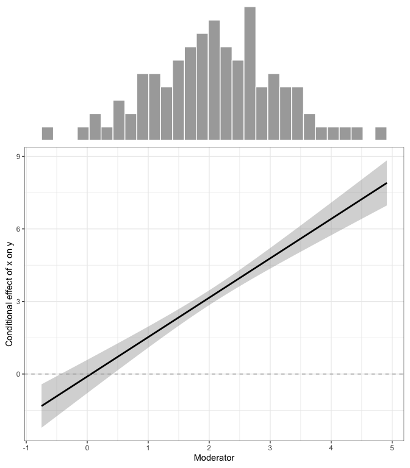

<!-- README.md is generated from README.Rmd. Please edit that file -->

# pmstats

<!-- badges: start -->

[](https://www.tidyverse.org/lifecycle/#experimental)
[](https://CRAN.R-project.org/package=specr)
<!-- badges: end -->

This package includes some custom-made functions to facilitate some
common statistical procedures as well as extracting and reporting
results from various models in RMarkdown articles. Please note that most
functions are highly costumized to my personal workflow. They may hence
break in more general frameworks or when used in a different,
non-intended way…

## Dependencies

Most functions require the following packages:

  - For data wrangling procedures: `tidyverse` and `magrittr`
  - For printing and typesetting: `papaja`
  - For SEM procedures: `lavaan` and `semTools`

These packages should be installed prior to using this package.

## Installation

You can install the development version from
[GitHub](https://github.com/) with:

``` r
# install.packages("devtools")
devtools::install_github("masurp/pmstats")
```

## Some examples

### Printing a zero order correlation table

``` r
library(pmstats)
(tab <- zero_order_corr(mtcars[,1:6], 
                        digits = 2, 
                        sig = T, 
                        print = T))
#>   Variables      M     SD     1     2     3     4     5
#> 1     1 mpg  20.09   6.03                              
#> 2     2 cyl   6.19   1.79 -.85*                        
#> 3    3 disp 230.72 123.94 -.85*  .90*                  
#> 4      4 hp 146.69  68.56 -.78*  .83*  .79*            
#> 5    5 drat   3.60   0.53  .68* -.70* -.71* -.45*      
#> 6      6 wt   3.22   0.98 -.87*  .78*  .89*  .66* -.71*
```

``` r
papaja::apa_table(tab, 
                  format = "html",
                  align = c("l", rep("r", 6)))
```

| Variables |      M |     SD |       1 |       2 |       3 |       4 | 5       |
| :-------- | -----: | -----: | ------: | ------: | ------: | ------: | :------ |
| 1 mpg     |  20.09 |   6.03 |         |         |         |         |         |
| 2 cyl     |   6.19 |   1.79 | \-.85\* |         |         |         |         |
| 3 disp    | 230.72 | 123.94 | \-.85\* |   .90\* |         |         |         |
| 4 hp      | 146.69 |  68.56 | \-.78\* |   .83\* |   .79\* |         |         |
| 5 drat    |   3.60 |   0.53 |   .68\* | \-.70\* | \-.71\* | \-.45\* |         |
| 6 wt      |   3.22 |   0.98 | \-.87\* |   .78\* |   .89\* |   .66\* | \-.71\* |

### Extracting result table from structural equation model

``` r
library(lavaan)

# Estimate SEM
model.sem <- '
  # latent variables
  ind60 =~ x1 + x2 + x3
  dem60 =~ y1 + y2 + y3 + y4
  dem65 =~ y5 + y6 + y7 + y8
  # regressions
  dem60 ~ a*ind60
  dem65 ~ b*ind60 + c*dem60
  # residual covariances
  y1 ~~ y5
  y2 ~~ y4 + y6
  y3 ~~ y7
  y4 ~~ y8
  y6 ~~ y8
'
fit.sem <- sem(model.sem, 
               data = PoliticalDemocracy)

# Extracting results (only regression paths )
results <- result_table(fit.sem, 
                         sem_regressions = TRUE, 
                         new_labels = c("H1", "H2", "H3"), 
                         print = TRUE)
```

``` r
papaja::apa_table(results, 
                  format = "html",
                  align = c(rep("c", 3), rep("r", 6)))
```

| outcome | predictor | label |    b |   se |   ll |   ul |       p | beta |
| :-----: | :-------: | :---: | ---: | ---: | ---: | ---: | ------: | ---: |
|  dem60  |   ind60   |  H1   | 1.48 | 0.40 | 0.70 | 2.27 | \< .001 |  .45 |
|  dem65  |   ind60   |  H2   | 0.57 | 0.22 | 0.14 | 1.01 |    .010 |  .18 |
|  dem65  |   dem60   |  H3   | 0.84 | 0.10 | 0.64 | 1.03 | \< .001 |  .89 |

``` r
# Print specific results for inline reporting
print_coeff(results, "H2", 
            se = FALSE, 
            beta = TRUE)
#> [1] "$b = 0.57$, 95\\% CI $[0.14, 1.01]$, $p = .010$, $\\beta = .18$"
```

### Plotting interactions

``` r
x <- rnorm(500, 2, 1)
z <- rnorm(500, 2, 1)
y <- 0.5*x + 1.5*(z*x) + rnorm(500, 0, 3.5)
# Estimate linear model
mod.lm <- lm(y ~ x + z + x:z)
summary(mod.lm)
#> 
#> Call:
#> lm(formula = y ~ x + z + x:z)
#> 
#> Residuals:
#>     Min      1Q  Median      3Q     Max 
#> -9.9562 -2.5150  0.1018  2.6584 11.2728 
#> 
#> Coefficients:
#>             Estimate Std. Error t value Pr(>|t|)    
#> (Intercept)   0.1085     0.8280   0.131    0.896    
#> x             0.2980     0.3732   0.799    0.425    
#> z            -0.2317     0.3820  -0.607    0.544    
#> x:z           1.6537     0.1711   9.667   <2e-16 ***
#> ---
#> Signif. codes:  0 '***' 0.001 '**' 0.01 '*' 0.05 '.' 0.1 ' ' 1
#> 
#> Residual standard error: 3.754 on 496 degrees of freedom
#> Multiple R-squared:  0.6287, Adjusted R-squared:  0.6265 
#> F-statistic:   280 on 3 and 496 DF,  p-value: < 2.2e-16
# Plot model
moderation_plot(mod.lm, x = "x", m = "z")
```


